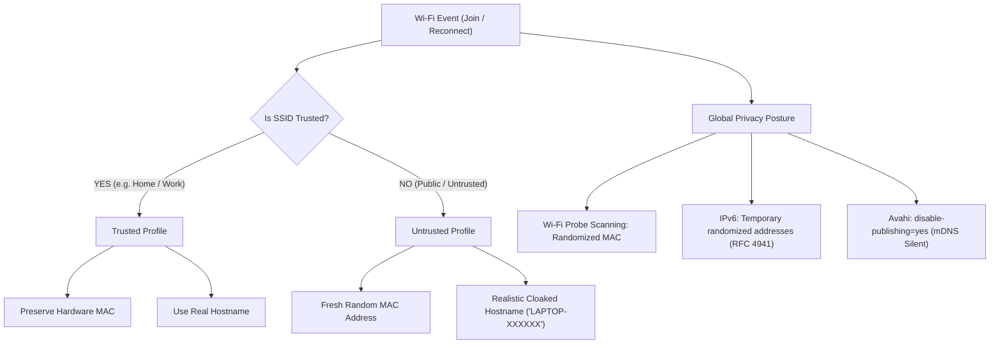

# Omarchy Wi-Fi Privacy Plugin (`omarchy-plugin-wifi-privacy`)

[](LICENSE)
[](manifest.json)

An **anti-tracking and privacy hardening plugin for Omarchy Linux**. It prevents Wi-Fi network operators, routers, and local subnet snoopers from identifying or tracking your machine across locations.

---

## Features

- 🛡️ **Per-Association MAC Randomization**: Automatically generates a completely fresh, randomized MAC address every time you connect or reconnect to untrusted Wi-Fi networks.
- 🏷️ **DHCP Hostname Cloaking**: Automatically generates realistic consumer device hostnames (e.g. `LAPTOP-7F4K2A`) on untrusted networks instead of leaking your actual system hostname (`omarchy`).
- 🏠 **Trusted Network Preservation**: Maintains your permanent hardware MAC address and real hostname on designated trusted networks (e.g. home or office).
- 🌐 **IPv6 Privacy Extensions (RFC 4941)**: Enables rotating temporary IPv6 addresses for outbound internet traffic so websites and CDNs cannot track your session.
- 🔕 **Silent Local Discovery (mDNS)**: Configures Avahi (`disable-publishing=yes`) to stop broadcasting your hostname to other devices on the local subnet.
- 📊 **Omarchy Status Bar Widget**: Sleek monochrome shield widget in the Omarchy bar showing real-time privacy status with a popup control panel.
- 💻 **CLI Management Utility**: Fast, scriptable command-line tool (`omarchy-wifi-privacy`) for checking status, toggling trust, and rotating identities.

---

## Architecture



---

## Installation

### Method 1: Git Clone & Installer Script (Recommended for development / reinstall)

```bash
git clone https://github.com/LoupiBe/omarchy-plugin-wifi-privacy.git
cd omarchy-plugin-wifi-privacy
sudo ./install.sh
```

Then enable the widget in your bar:

```bash
omarchy bar add io.github.loupibe.omarchy-wifi-privacy --section right
```


## CLI Usage

The plugin installs a companion CLI utility `omarchy-wifi-privacy`:

```bash
# Check current privacy and identity posture
omarchy-wifi-privacy status

# Output machine-readable JSON (used by the bar popup widget)
omarchy-wifi-privacy status --json

# Mark current Wi-Fi network as trusted (preserves physical MAC)
omarchy-wifi-privacy trust

# Mark a specific SSID as trusted
omarchy-wifi-privacy trust "MyHomeWiFi"

# Mark network as untrusted (randomizes MAC and generates cloaked hostname)
omarchy-wifi-privacy untrust

# Force an immediate identity rotation (generates fresh MAC + fake hostname)
omarchy-wifi-privacy randomize
```

---

## Repository Structure

```
├── manifest.json                  # Omarchy plugin manifest (schemaVersion 1)
├── omarchy-plugin.json            # Marketplace manifest copy
├── BarWidget.qml                  # Status bar entry point & panel lifecycle forwarder
├── Panel.qml                      # Popup control panel & details
├── Model.js                       # QML helper functions and JSON parsers
├── bin/
│   └── omarchy-wifi-privacy       # Standalone privacy management CLI
├── system/
│   ├── 30-wifi-privacy.conf       # NetworkManager global privacy rules
│   └── 10-dhcp-hostname-privacy.sh # NM pre-up dispatcher hook for hostname cloaking
├── test.js                        # Security & hardening regression test suite
├── .github/
│   └── workflows/ci.yml          # Automated CI verification workflow
├── install.sh                     # Automated system & plugin installer
├── uninstall.sh                   # Clean removal and settings restore
├── LICENSE                        # MIT License
└── README.md                      # Documentation
```

---

## Publishing to plugins.omarchy.org

This plugin complies with the Omarchy plugin manifest schema and passes `omarchy plugin validate`:

```bash
omarchy plugin validate .
```

To submit to the Omarchy plugin directory:
1. Ensure the repository is publicly accessible on GitHub: `https://github.com/LoupiBe/omarchy-plugin-wifi-privacy`.
2. Submit a PR or listing request to the Omarchy plugin registry at [plugins.omarchy.org](https://plugins.omarchy.org/).

---

## Uninstallation

To cleanly revert all system configurations and remove the plugin:

```bash
sudo ./uninstall.sh
```

---

## License

[MIT](LICENSE) © 2026 Loupi (LoupiBe)
